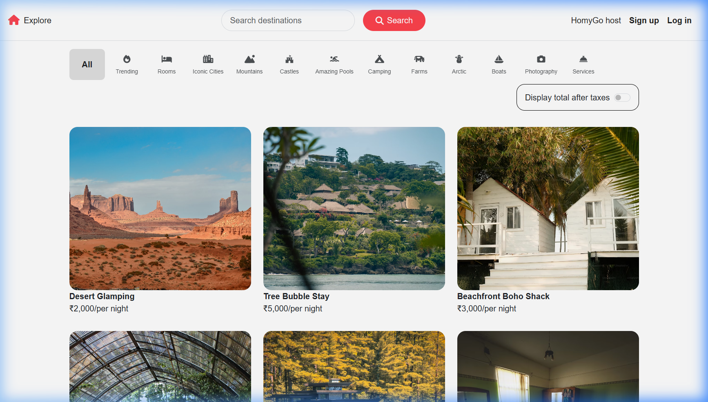
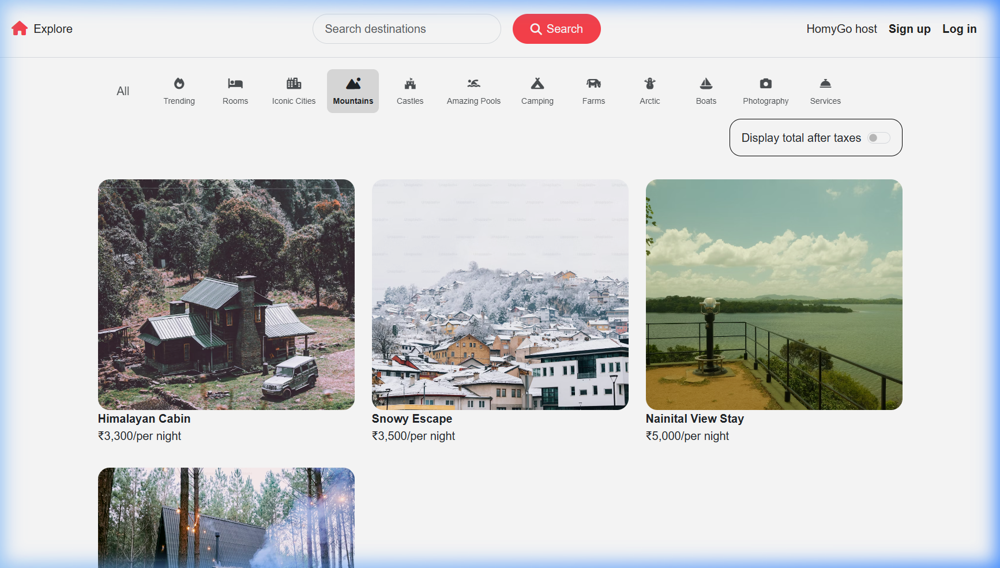
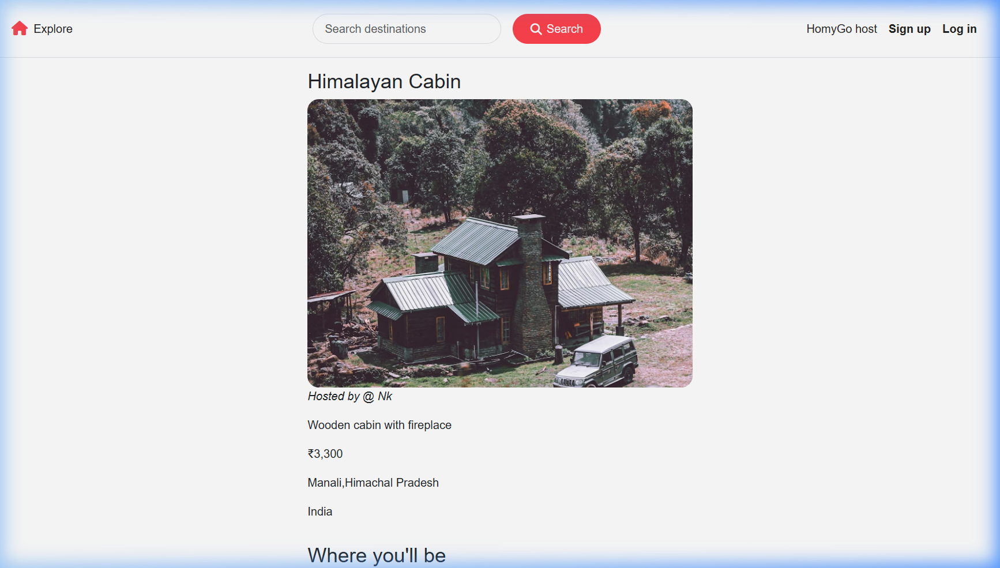
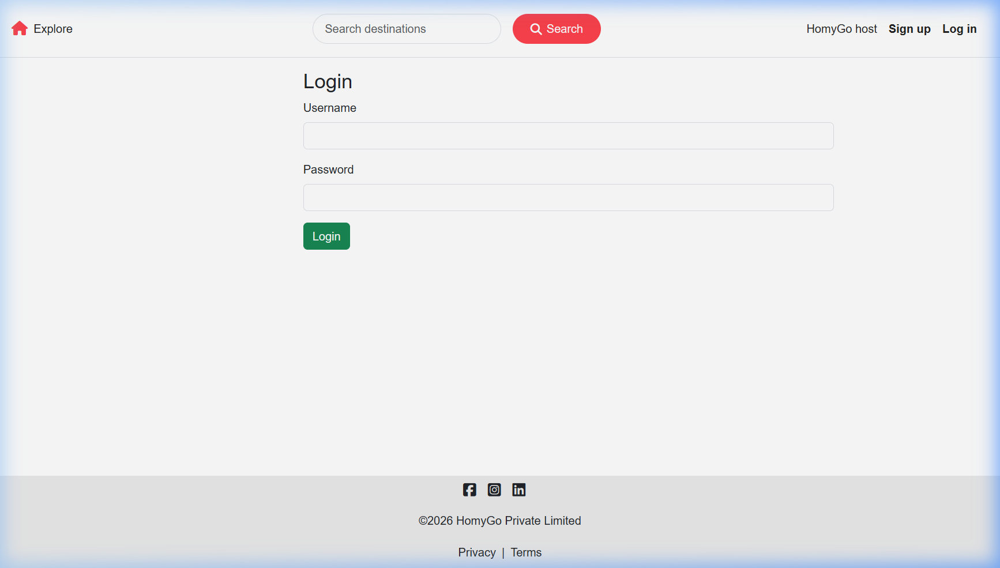

<div align="center">

# 🏡 HomyGo

### *Discover Your Perfect Stay — Anywhere in the World*

[](https://nodejs.org/)
[](https://expressjs.com/)
[](https://www.mongodb.com/)
[](https://cloudinary.com/)
[](https://www.mapbox.com/)


**HomyGo** is a full-stack Airbnb-inspired property listing platform where users can explore, list, and review unique stays across India and beyond — from cozy Himalayan cabins to beachfront boho shacks.

🌐 **[Live Demo → wanderlust-ynlv.onrender.com](https://wanderlust-ynlv.onrender.com)**

</div>

---

## 📸 Screenshots

### 🏠 Homepage — Explore All Listings


---

### 🗂️ Category Filtering — Mountains


---

### 📍 Listing Detail Page


---

### 🔐 Authentication — Login


---

## ✨ Key Features

| Feature | Description |
|---|---|
| 🔍 **Smart Search** | Search listings by title or location in real-time |
| 🗂️ **Category Filters** | Browse by Trending, Mountains, Castles, Arctic, Boats & more |
| 📸 **Cloud Image Uploads** | Property images stored and served via Cloudinary CDN |
| 🗺️ **Interactive Maps** | Each listing displays its exact location using Mapbox GL |
| 👤 **User Authentication** | Secure sign-up, login & session management with Passport.js |
| 🏠 **Host Your Property** | Authenticated users can create, edit & delete their own listings |
| ⭐ **Reviews & Ratings** | Leave reviews on any listing; owners can manage their own reviews |
| 🔒 **Authorization Guards** | Only listing owners can modify or delete their content |
| ✅ **Server-side Validation** | Input validated using Joi schemas before DB writes |
| 📱 **Responsive Design** | Fully mobile-friendly UI built with Bootstrap |
| 💡 **Flash Notifications** | Instant success/error feedback using connect-flash |

---

## 🛠️ Tech Stack

### Backend
- **Runtime:** Node.js v22
- **Framework:** Express.js v5
- **Database:** MongoDB (Atlas) via Mongoose v8
- **Authentication:** Passport.js + passport-local-mongoose
- **Sessions:** express-session + connect-mongo (persistent MongoDB sessions)
- **Validation:** Joi
- **Image Uploads:** Multer + multer-storage-cloudinary
- **Maps & Geocoding:** Mapbox SDK (`@mapbox/mapbox-sdk`)
- **Environment Config:** dotenv

### Frontend
- **Templating:** EJS with ejs-mate layouts
- **Styling:** Bootstrap 5 + custom CSS
- **Maps:** Mapbox GL JS

### Infrastructure & DevOps
- **Image CDN:** Cloudinary
- **Hosting:** Render (free tier with self-ping keep-alive)
- **Database Hosting:** MongoDB Atlas

---

## 📁 Project Structure

```
MAJORPROJECT/
├── controllers/          # Route handler logic
│   ├── listings.js       # CRUD for property listings + geocoding
│   ├── reviews.js        # Create & delete reviews
│   └── users.js          # Signup, login, logout
├── models/               # Mongoose schemas
│   ├── listing.js        # Listing schema (title, price, location, geo, category…)
│   ├── reviews.js        # Review schema
│   └── user.js           # User schema (passport-local-mongoose)
├── routes/               # Express routers
│   ├── listing.js        # /listings — full CRUD routes
│   ├── review.js         # /listings/:id/reviews
│   └── user.js           # /signup, /login, /logout
├── views/                # EJS templates
│   ├── layouts/          # Shared boilerplate (navbar, footer)
│   ├── includes/         # Flash messages, navbar partials
│   ├── listings/         # index, show, new, edit pages
│   └── users/            # signup & login forms
├── public/               # Static assets (CSS, JS, utils)
├── cloudConfig.js        # Cloudinary storage config
├── middleware.js          # isLoggedIn, isOwner, validateListing guards
├── schema.js             # Joi validation schemas
└── app.js                # Express app entry point
```

---

## 🚀 Getting Started

### Prerequisites
- Node.js ≥ 18
- MongoDB Atlas account (or local MongoDB)
- Cloudinary account
- Mapbox account

### 1. Clone the repository
```bash
git clone https://github.com/AtulRao22/Wanderlust.git
cd Wanderlust
```

### 2. Install dependencies
```bash
npm install
```

### 3. Configure environment variables

Create a `.env` file in the root directory:

```env
ATLASDB_URL=your_mongodb_atlas_connection_string
SECRET=your_session_secret_key
CLOUD_NAME=your_cloudinary_cloud_name
CLOUD_API_KEY=your_cloudinary_api_key
CLOUD_API_SECRET=your_cloudinary_api_secret
MAP_TOKEN=your_mapbox_public_access_token
```

### 4. (Optional) Seed the database
```bash
node init/index.js
```

### 5. Start the server
```bash
node app.js
```

Visit **http://localhost:3000** in your browser.

---

## 🔐 Environment Variables Reference

| Variable | Description |
|---|---|
| `ATLASDB_URL` | MongoDB Atlas connection URI |
| `SECRET` | Session encryption secret (any long random string) |
| `CLOUD_NAME` | Cloudinary cloud name |
| `CLOUD_API_KEY` | Cloudinary API key |
| `CLOUD_API_SECRET` | Cloudinary API secret |
| `MAP_TOKEN` | Mapbox public access token |

---

## 🗺️ API Routes Overview

| Method | Route | Description | Auth Required |
|---|---|---|---|
| GET | `/listings` | Browse all listings (with search & filter) | ❌ |
| GET | `/listings/new` | Form to create a new listing | ✅ |
| POST | `/listings` | Create a new listing | ✅ |
| GET | `/listings/:id` | View a listing detail + map + reviews | ❌ |
| GET | `/listings/:id/edit` | Edit form for a listing | ✅ Owner only |
| PUT | `/listings/:id` | Update a listing | ✅ Owner only |
| DELETE | `/listings/:id` | Delete a listing | ✅ Owner only |
| POST | `/listings/:id/reviews` | Submit a review | ✅ |
| DELETE | `/listings/:id/reviews/:reviewId` | Delete a review | ✅ Author only |
| GET | `/signup` | Signup form | ❌ |
| POST | `/signup` | Register a new user | ❌ |
| GET | `/login` | Login form | ❌ |
| POST | `/login` | Authenticate user | ❌ |
| GET | `/logout` | Logout current user | ✅ |

---

## 🏷️ Listing Categories

The platform supports **12 curated property categories**:

`🔥 Trending` &nbsp; `🛏️ Rooms` &nbsp; `🌆 Iconic Cities` &nbsp; `⛰️ Mountains` &nbsp; `🏰 Castles` &nbsp; `🏊 Amazing Pools` &nbsp; `⛺ Camping` &nbsp; `🌾 Farms` &nbsp; `🧊 Arctic` &nbsp; `⛵ Boats` &nbsp; `📷 Photography` &nbsp; `🛎️ Services`

---

## 👨‍💻 Author

<div align="center">

**Atul Rao**

*Full-Stack Developer | MERN Stack Enthusiast*

[](https://github.com/AtulRao22)

</div>

---

<div align="center">

*Built with ❤️ to practice real-world full-stack development — from user authentication and cloud storage to geospatial mapping.*

⭐ **Star this repo if you found it helpful!**

</div>